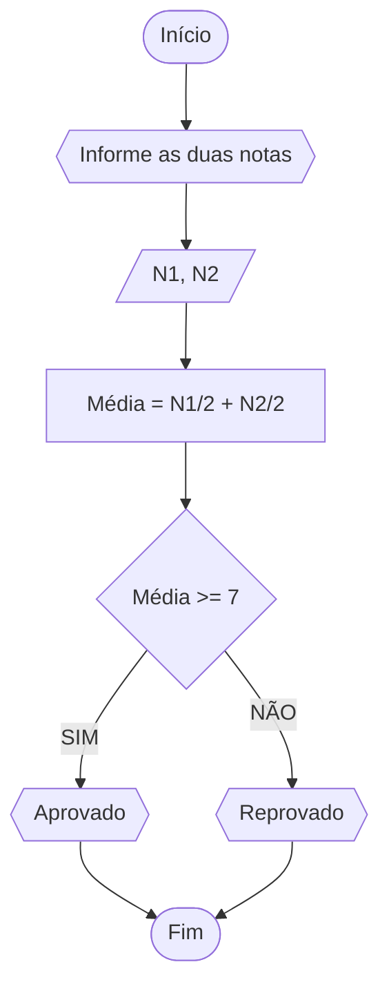
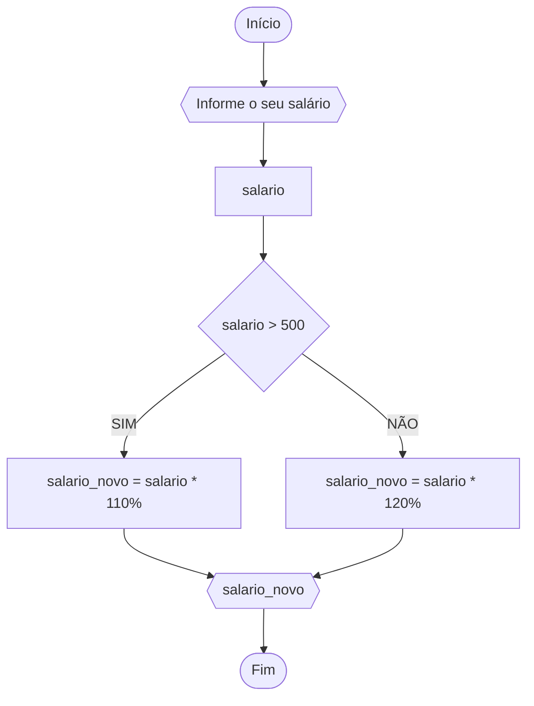
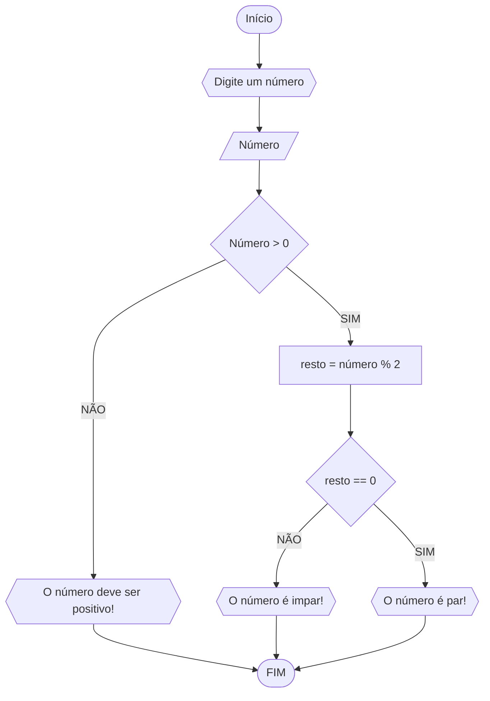

# UNIFOR
**Disciplina:** Raciocínio lógico
**Orientador:** Prof. Ricardo Carubbi

## Lista de exercícios


### Exercício 01
Represente, em fluxograma e pseudocódigo, um algoritmo para calcular a média aritmética entre duas notas de um aluno e mostrar sua situação, que pode ser aprovado ou reprovado;
#### Fluxograma



```
ALGORITMO
DECLARE N1, N2, M NUMÉRICO 
ESCREVA “Digite as duas notas” 
LEIA N1, N2 
M = (N1+N2)/2
SE M >= 7
	ENTÃO ESCREVA “Aprovado” 
SENÃO  
	ESCREVA “Reprovado“ 
FIM_ALGORITMO.
```

### Exercício 02
Represente, em fluxograma e pseudocódigo, um algoritmo para calcular o novo salário de um funcionário. Sabe-se que os funcionários que recebem atualmente salário de até R$ 500 terão aumento de 20%; os demais terão aumento de 10%
#### Fluxograma



```
ALGORITMO
DECLARE salario, salario_novo NUMÉRICO 
ESCREVA “Digite seu salário” 
LEIA salario
SE salario > 500
	ENTÃO
		salario_novo = salario * 110%
		ESCREVA "salario_novo"
SENÃO
	salario_novo = salario * 120%
	ESCREVA “salario_novo“ 
FIM_ALGORITMO.
```

### Exercício 3

3) Represente, em fluxograma e pseudocódigo, um algoritmo para determinar se um número inteiro e positivo é par ou impar.

#### Fluxograma


```
ALGORITMO verifica_par_ímpar
DECLARE numero, resto INTEIRO
ESCREVA "Digite um número: "
LEIA numero, resto
SE numero > 0 ENTAO
    resto = numero % 2
    SE resto == 0 ENTAO
       ESCREVA "O número é par"
    SENÃO 
       ESCREVA "O número é ímpar"
SENAO 
    ESCREVA "O número deve ser positivo!"
 
FIM_ALGORITMO

```


