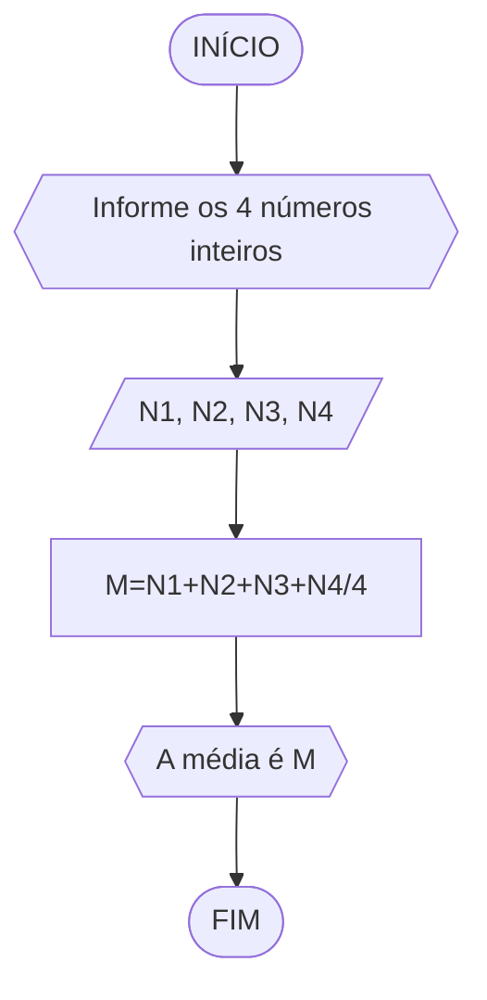

# Unifor
## Lista 02
### Exercício 1

Calcule a média de quatro números inteiros dados



```
ALGORITMO
DECLARE N1,N2,N3,N4,M INTEIRO
INICIO
ESCREVA "Informe os 4 números inteiros: "
LEIA N1,N2,N3,N4
M=(N1+N2+N3+N4)/4
ESCREVA " A média é: ",M
FIM

```
