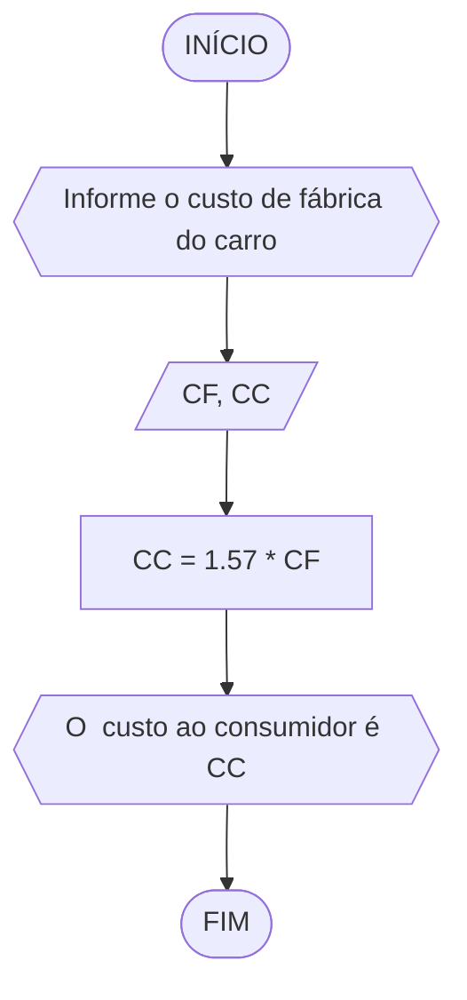

# Unifor
## Lista 02
### Exercício 1

Calcule a média de quatro números inteiros dados


```
ALGORITMO
DECLARE N1,N2,N3,N4,M INTEIRO
INICIO
ESCREVA "Informe os 4 números inteiros: "
LEIA N1,N2,N3,N4
M=(N1+N2+N3+N4)/4
ESCREVA " A média é: ",M
FIM

```

### Exercício 2

Leia uma temperatura dada na escala Celsius (C) e imprima o equivalente em Fahrenheit (F). (Fórmula de conversão: F = (9/5) * C + 32)


```
ALGORITMO converter_temperatura
DECLARE TC, TF: REAL
ESCREVA "Digite a temperatura em gaus Celsius: "
LEIA TC
TF = (9/5) * TC + 32
ESCREVA "A temperatura em graus Fahrenheit é: ",TF
FIM
```

### Exercício 3

Leia uma quantidade de chuva dada em polegadas e imprima o equivalente em milímetros (25,4 mm = 1 polegada)


```
ALGORITMO converter_volume
DECLARE VP, VM: REAL
ESCREVA "Informe o volume de chuva em polegadas: "
LEIA VP
VM = VP * 25,4
ESCREVA "O volume de chuva em milímetros é: ",VM
FIM
```
### Exercício 4

O custo ao consumidor de um carro novo é a soma do custo de fábrica com a porcentagem do distribuidor e dos impostos, ambos aplicados ao custo de fábrica. Supondo que a porcentagem do distribuidor seja de 12% e a dos impostos de 45%, prepare um algoritmo para ler o custo de fábrica do carro e imprimir o custo ao consumidor




```
ALGORITMO custo_carro
DECLARE CF, CC: REAL
ESCREVA "Informe o custo de fábrica do carro: "
LEIA CF
CC = 1.57 * CF
ESCREVA "O  custo ao consumidor é: ",CC
FIM
```

### Exercício 5

Calcule o quadrado de um número


```
ALGORITMO quadrado_numero
DECLARE numero, numero_quadrado: REAL
ESCREVA "Informe um número: "
LEIA numero
numero_quadrado = numero * numero
ESCREVA "O  quadrado do número informado é: ",numero_quadrado
FIM
```

Algoritmo calcularContaFinal
    // Declaração de variáveis
    quantidadeHamburguer, quantidadeCheeseburger, quantidadeFritas, quantidadeRefrigerante, quantidadeMilkshake: inteiro
    precoHamburguer, precoCheeseburger, precoFritas, precoRefrigerante, precoMilkshake: real
    total: real
    
    // Definição dos preços dos itens
    precoHamburguer <- 3.00
    precoCheeseburger <- 2.50
    precoFritas <- 2.50
    precoRefrigerante <- 1.00
    precoMilkshake <- 3.00
    
    // Entrada de dados
    Escrever("Quantidade de Hambúrgueres consumidos: ")
    Ler(quantidadeHamburguer)
    
    Escrever("Quantidade de Cheeseburgers consumidos: ")
    Ler(quantidadeCheeseburger)
    
    Escrever("Quantidade de Fritas consumidas: ")
    Ler(quantidadeFritas)
    
    Escrever("Quantidade de Refrigerantes consumidos: ")
    Ler(quantidadeRefrigerante)
    
    Escrever("Quantidade de Milkshakes consumidos: ")
    Ler(quantidadeMilkshake)
    
    // Calcula o total da conta
    total <- (quantidadeHamburguer * precoHamburguer) + (quantidadeCheeseburger * precoCheeseburger) + (quantidadeFritas * precoFritas) + (quantidadeRefrigerante * precoRefrigerante) + (quantidadeMilkshake * precoMilkshake)
    
    // Saída de dados
    Escrever("Total da conta: R$", total)
Fim Algoritmo
