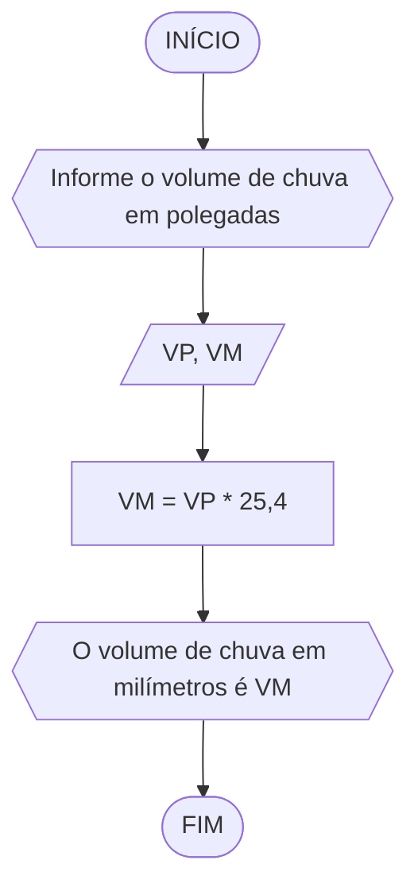
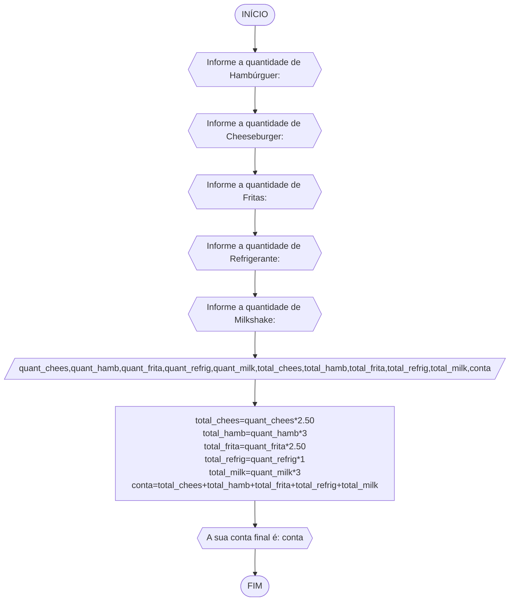

# Unifor
## Lista 02
### Exercício 1

Calcule a média de quatro números inteiros dados


```
ALGORITMO
DECLARE N1,N2,N3,N4,M INTEIRO
INICIO
ESCREVA "Informe os 4 números inteiros: "
LEIA N1,N2,N3,N4
M=(N1+N2+N3+N4)/4
ESCREVA " A média é: ",M
FIM

```

### Exercício 2

Leia uma temperatura dada na escala Celsius (C) e imprima o equivalente em Fahrenheit (F). (Fórmula de conversão: F = (9/5) * C + 32)


```
ALGORITMO converter_temperatura
DECLARE TC, TF: REAL
ESCREVA "Digite a temperatura em gaus Celsius: "
LEIA TC
TF = (9/5) * TC + 32
ESCREVA "A temperatura em graus Fahrenheit é: ",TF
FIM
```

### Exercício 3

Leia uma quantidade de chuva dada em polegadas e imprima o equivalente em milímetros (25,4 mm = 1 polegada)



```
ALGORITMO converter_volume
DECLARE VP, VM: REAL
ESCREVA "Informe o volume de chuva em polegadas: "
LEIA VP
VM = VP * 25,4
ESCREVA "O volume de chuva em milímetros é: ",VM
FIM
```
### Exercício 4

O custo ao consumidor de um carro novo é a soma do custo de fábrica com a porcentagem do distribuidor e dos impostos, ambos aplicados ao custo de fábrica. Supondo que a porcentagem do distribuidor seja de 12% e a dos impostos de 45%, prepare um algoritmo para ler o custo de fábrica do carro e imprimir o custo ao consumidor


```
ALGORITMO custo_carro
DECLARE CF, CC: REAL
ESCREVA "Informe o custo de fábrica do carro: "
LEIA CF
CC = 1.57 * CF
ESCREVA "O  custo ao consumidor é: ",CC
FIM
```

### Exercício 5

Calcule o quadrado de um número


```
ALGORITMO quadrado_numero
DECLARE numero, numero_quadrado: REAL
ESCREVA "Informe um número: "
LEIA numero
numero_quadrado = numero * numero
ESCREVA "O  quadrado do número informado é: ",numero_quadrado
FIM
```

### Exercício 6

O cardápio de uma lanchonete é dado abaixo. Prepare um algoritmo que leia a quantidade de cada item que você consumiu e calcule a conta final. 
a) Hambúrguer................ R$ 3,00 
b) Cheeseburger.............. R$ 2,50 
c) Fritas.................... R$ 2,50 
d) Refrigerante ............. R$ 1,00 
e) Milkshake................. R$ 3,00



```
ALGORITMO conta_final
DECLARE quant_chees,quant_hamb,quant_frita,quant_refrig,quant_milk,total_chees,total_hamb,total_frita,total_refrig,total_milk,conta: REAL
ESCREVA "Informe a quantidade de Hambúrguer: "
LEIA quant_hamb
ESCREVA "Informe a quantidade de Cheeseburger: "
LEIA quant_chees
ESCREVA "Informe a quantidade de Fritas: "
LEIA quant_frita
ESCREVA "Informe a quantidade de Refrigerante: "
LEIA quant_refrig
ESCREVA "Informe a quantidade de Milkshake: "
LEIA quant_milk
total_chees=quant_chees*2.50
total_hamb=quant_hamb*3
total_frita=quant_frita*2.50
total_refrig=quant_refrig*1
total_milk=quant_milk*3
conta=total_chees+total_hamb+total_frita+total_refrig+total_milk
ESCREVA "A sua conta final é:",conta
FIM
```


```
ALGORITMO conta_final
DECLARE conta=0: REAL 
		valor[5]={3.00, 2.50, 2.50, 1.00, 3.00}: REAL
		quantidade[5]: INTEIRO
INICIO
ESCREVA "Item 1-Hambúrguer, item 2-Cheeseburger, item 3-Fritas, item 4-Refrigerante, item 5-Milkshake"
PARA i de 0 até 4 passo 1 
	ESCREVA "Quantidade de item ", i + 1, " consumidos: " 			
	LEIA quantidade[i] 
FIM PARA
PARA i de 0 até 4 passo 2
	conta = valor + valor[i]*quantidade[i]
FIM PARA
ESCREVA "O valor da final da conta é:", conta
FIM
```
