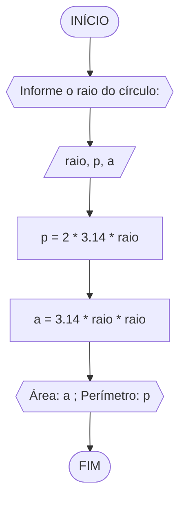

# Unifor
## Lista 02
### Exercício 1

Calcule a média de quatro números inteiros dados


```
ALGORITMO
DECLARE N1,N2,N3,N4,M INTEIRO
INICIO
ESCREVA "Informe os 4 números inteiros: "
LEIA N1,N2,N3,N4
M=(N1+N2+N3+N4)/4
ESCREVA " A média é: ",M
FIM

```

### Exercício 2

Leia uma temperatura dada na escala Celsius (C) e imprima o equivalente em Fahrenheit (F). (Fórmula de conversão: F = (9/5) * C + 32)


```
ALGORITMO converter_temperatura
DECLARE TC, TF: REAL
ESCREVA "Digite a temperatura em gaus Celsius: "
LEIA TC
TF = (9/5) * TC + 32
ESCREVA "A temperatura em graus Fahrenheit é: ",TF
FIM
```

### Exercício 3

Leia uma quantidade de chuva dada em polegadas e imprima o equivalente em milímetros (25,4 mm = 1 polegada)


```
ALGORITMO converter_volume
DECLARE VP, VM: REAL
ESCREVA "Informe o volume de chuva em polegadas: "
LEIA VP
VM = VP * 25,4
ESCREVA "O volume de chuva em milímetros é: ",VM
FIM
```
### Exercício 4

O custo ao consumidor de um carro novo é a soma do custo de fábrica com a porcentagem do distribuidor e dos impostos, ambos aplicados ao custo de fábrica. Supondo que a porcentagem do distribuidor seja de 12% e a dos impostos de 45%, prepare um algoritmo para ler o custo de fábrica do carro e imprimir o custo ao consumidor


```
ALGORITMO custo_carro
DECLARE CF, CC: REAL
ESCREVA "Informe o custo de fábrica do carro: "
LEIA CF
CC = 1.57 * CF
ESCREVA "O  custo ao consumidor é: ",CC
FIM
```

### Exercício 5

Calcule o quadrado de um número


```
ALGORITMO quadrado_numero
DECLARE numero, numero_quadrado: REAL
ESCREVA "Informe um número: "
LEIA numero
numero_quadrado = numero * numero
ESCREVA "O  quadrado do número informado é: ",numero_quadrado
FIM
```

### Exercício 6

O cardápio de uma lanchonete é dado abaixo. Prepare um algoritmo que leia a quantidade de cada item que você consumiu e calcule a conta final. 
a) Hambúrguer................ R$ 3,00 
b) Cheeseburger.............. R$ 2,50 
c) Fritas.................... R$ 2,50 
d) Refrigerante ............. R$ 1,00 
e) Milkshake................. R$ 3,00


```
ALGORITMO conta_final
DECLARE quant_chees,quant_hamb,quant_frita,quant_refrig,quant_milk,total_chees,total_hamb,total_frita,total_refrig,total_milk,conta: REAL
ESCREVA "Informe a quantidade de Hambúrguer: "
LEIA quant_hamb
ESCREVA "Informe a quantidade de Cheeseburger: "
LEIA quant_chees
ESCREVA "Informe a quantidade de Fritas: "
LEIA quant_frita
ESCREVA "Informe a quantidade de Refrigerante: "
LEIA quant_refrig
ESCREVA "Informe a quantidade de Milkshake: "
LEIA quant_milk
total_chees=quant_chees*2.50
total_hamb=quant_hamb*3
total_frita=quant_frita*2.50
total_refrig=quant_refrig*1
total_milk=quant_milk*3
conta=total_chees+total_hamb+total_frita+total_refrig+total_milk
ESCREVA "A sua conta final é:",conta
FIM
```


```
ALGORITMO conta_final
DECLARE conta=0: REAL 
		valor[5]={3.00, 2.50, 2.50, 1.00, 3.00}: REAL
		quantidade[5]: INTEIRO
INICIO
ESCREVA "Item 1-Hambúrguer, item 2-Cheeseburger, item 3-Fritas, item 4-Refrigerante, item 5-Milkshake"
PARA i de 0 até 4 passo 1 
	ESCREVA "Quantidade de item ", i + 1, " consumidos: " 			
	LEIA quantidade[i] 
FIM PARA
PARA i de 0 até 4 passo 2
	conta = valor + valor[i]*quantidade[i]
FIM PARA
ESCREVA "O valor da final da conta é:", conta
FIM
```
### Exercício 7

Uma companhia de carros paga a seus empregados um salário de R$ 500,00 por mês mais uma comissão de R$ 50,00 para cada carro vendido e mais 5% do valor da venda. Elabore um algoritmo para calcular e imprimir o salário do vendedor num dado mês recebendo como dados de entrada o nome do vendedor, o número de carros vendidos e o valor total das vendas.


```
ALGORITMO salario_vendas
DECLARE nome: CARACTERE
		nc: INTEIRO
		vv, salario: REAL
ESCREVA "Informe seu nome: "
LEIA nome
ESCREVA "Informe o número de carros vendidos: "
LEIA nc
ESCREVA "Informe o valor total das vendas: "
LEIA vv
salario = 500+(50 * nc + 0.05 * vv)
ESCREVA "O salário do funcionário ", nome, "é :", salario
FIM
```
### Exercício 8

Calcule a média de um aluno na disciplina de RLA. Para isso solicite o nome do aluno, a nota da prova e a nota qualitativa. Sabe-se que a nota da prova tem peso 2 e a nota qualitativa peso 1. Mostre a média como resultado.


```
ALGORITMO media_ponderada
DECLARE nome: CARACTERE
		media, NP, NQ: REAL
ESCREVA "Informe seu nome: "
LEIA nome
ESCREVA "Informe a nota da prova: "
LEIA NP
ESCREVA "Informe a nota qualitativa: "
LEIA NQ
media = (NP*2 + NQ*1)/3
ESCREVA "A média do aluno é: ", media
FIM
```
### Exercício 9

Suponha que você deseja preencher a seguinte ficha de inscrição de um estudante: nome, matrícula, curso, idade, e-mail. Imprima os dados do usuário como uma ficha preenchida


```
ALGORITMO ficha_inscricao
DECLARE nome, curso, email: CARACTERE
		matricula, idade: INTEIRO
ESCREVA "Informe seu nome: "
LEIA nome
ESCREVA "Informe sua matrícula: "
LEIA matricula
ESCREVA "Informe seu curso: "
LEIA curso
ESCREVA "Informe sua idade: "
LEIA idade
ESCREVA "Informe seu e-mail: "
LEIA email
ESCREVA "Nome: ", nome
	"Matricula: ", matricula
	"Curso: ", curso
	"Idade: ", idade
	"E-mail: , email
FIM
```
### Exercício 10

Calcule e mostre a área e o perímetro de um círculo. Sabe-se que a área = Ⲡ * raio2 e o perímetro = 2 * Ⲡ * raio.


```
ALGORITMO area_circulo
DECLARE raio, p, a: REAL
ESCREVA "Informe o raio do círculo: "
LEIA raio
p = 2 * 3.14 * raio
a = 3.14 * raio * raio
ESCREVA "Área do círculo é ", a, " e o perímetro é ", p
FIM
```
### Exercício 11

Faça um programa que receba um número positivo e maior que zero, calcule e mostre:
a) o número digitado ao quadrado;
b) o número digitado ao cubo;
c) a raiz quadrada do número digitado;
d) a raiz cúbica do número digitado


```
ALGORITMO exponencial
DECLARE numero, num_quadrado, num_cubo, raiz_quad, raiz_cub: REAL
ESCREVA "Informe um número: "
LEIA numero
SE numero > 0 ENTAO
	num_quadrado = numero ** 2 
	num_cubo = numero ** 3
	raiz_quad = numero ** 1/2
	raiz_cub = numero ** 1/3
SENÃO
	ESCREVA "O número deve ser positivo e maior que zero!"
FIM_SE
ESCREVA "Quadrado: ", num_quadrado "Cubo: ", num_cubo "Raiz quadrada: ", raiz_quad "Raíz cúbica: ", raiz_cub
FIM
```
### Exercício 12

Faça um algoritmo que lê três números inteiros e mostra-os em ordem crescente.


```
ALGORITMO ordem_crescente
VAR N1, N2, N3, temp: INTEIRO
INICIO
ESCREVA "Informe o primeiro número: "
LEIA N1
ESCREVA "Informe o segundo número: "
LEIA N2
ESCREVA "Informe o terceiro número: "
LEIA N3
SE N1 > N2 ENTÃO
	temp=N1
	N1=N2
	N2=temp
FIM_SE
SE N1 > N3 ENTÃO
	temp=N1
	N1=N3
	N3=temp
FIM_SE
SE N2 > N3 ENTÃO
	temp=N2
	N2=N3
	N3=temp
FIM_SE
ESCREVA "O números em ordem crescente são: " N1, N2, N3
FIM
```
### Exercício 13

Elaborar um algoritmo que, dada a idade de um nadador, classificá-lo nas categorias:
a) infantil A (5 - 7 anos),
b) infantil, B (8 -10 anos),
c) juvenil A (11 - 13 anos),
d) juvenil B (14 -17 anos) e
e) adulto (maiores que 18 anos).
SE idade<5 
Não pode nadar
SE idade 


```
ALGORITMO categoria_nadador
VAR idade: INTEIRO
INICIO
ESCREVA "Informe a idade do nadador(a): "
LEIA idade
SE idade<5 ENTÃO
	ESCREVA "Muito novo para nadar"
FIM_SE
SE idade>=5 e idade<=7 ENTÃO
	ESCREVA "O nadador está na categoria infantil A"
FIM_SE
SE idade>=8 e idade<=10 ENTÃO
	ESCREVA "O nadador está na categoria infantil B"
FIM_SE
SE idade>=11 e idade<=13 ENTÃO
	ESCREVA "O nadador está na categoria juvenil A"
FIM_SE
SE idade>=14 e idade<=17 ENTÃO
	ESCREVA "O nadador está na categoria juvenil B"
FIM_SE
SE idade>=18 ENTÃO
	ESCREVA "O nadador está na categoria adulto"
FIM
```
### Exercício 14

Dado três inteiros crie um algoritmo para retornar o menor deles.


```
ALGORITMO numero_menor
VAR N1, N2, N3: INTEIRO
INICIO
ESCREVA "Informe o 1º número inteiro:  "
LEIA N1
ESCREVA "Informe o 2º número inteiro:  "
LEIA N2
ESCREVA "Informe o 3º número inteiro:  "
LEIA N3
SE N1<N2 e N1<N3 ENTÃO
	ESCREVA "O menor número é N1"
SENÃO
	SE N2<N1 e N2<N3 ENTÃO
		ESCREVA "O menor número é N2"
	SENÃO
		ESCREVA "O menor número é N3"
FIM
```
```
Alternativa:
ALGORITMO menor_numero
VAR N1, N2, N3, menor: INTEIRO
INICIO
ESCREVA "Informe o 1º número inteiro:  "
LEIA N1
ESCREVA "Informe o 2º número inteiro:  "
LEIA N2
ESCREVA "Informe o 3º número inteiro:  "
LEIA N3
menor=N1
SE N2<menor ENTÃO
menor=N2
FIM_SE
SE N3<menor ENTÃO
menor=N3
FIM_SE
ESCREVA "O menor número é: menor"
FIM
```
### Exercício 15

Faça um algoritmo para converter um peso expresso em libras para quilogramas (1Kg =
1Lb * 2.2). Uma vez que o peso não pode ser um número negativo, o nosso programa não
deve aceitar um número negativo como um peso válido.


```
ALGORITMO numero_menor
VAR peso, peso_kg: REAL
INICIO
ESCREVA "Informe um peso em libras: "
LEIA peso
SE peso>=0 ENTÃO
	peso_kg=peso*2.2
	ESCREVA "O peso informado em kg é: ",peso_kg
SENÃO
	ESCREVA "O peso deve ser um valor positivo "
FIM
```
### Exercício 16

Leia uma média e exiba o status de um aluno:
a) AP se o aluno está aprovado (média final >= 6);
b) RM se o aluno está reprovado (média final < 3);
c) PF se o aluno está em prova final (caso contrário).


```
ALGORITMO status_aluno
VAR media: REAL
INICIO
ESCREVA "Informe a sua média: "
LEIA media
SE media<3 ENTÃO
	ESCREVA "O aluno está reprovado."
SE media>=6 ENTÃO
	ESCREVA "O aluno está aprovado!"
SENÃO
	ESCREVA "O aluno está em prova final"
FIM
```
### Exercício 17

Suponha que saindo da UNIFOR seu primeiro salário será de R$ 5.000,00. O do seu colega que não fez UNIFOR é de R$ 2.500,00. Infelizmente, ambos precisam pagar impostos. Crie um algoritmo para calcular o salário líquido de vocês e de outras pessoas.


```
ALGORITMO salario_liquido
VAR salario: REAL
INICIO
ESCREVA "Informe o seu salário: "
LEIA salario
SE salario <=1.499,15 ENTÃO
	ESCREVA "Seu salário líquido é: salario"
SE salario >=1.499,16 e salario <=2.246,75 ENTÃO
	salario=salario-salario*0.075
	ESCREVA "Seu salário líquido é: salario"
SE salario>=2.246,76 e salario<=2.995,70 ENTÃO
	salario=salario-salario*0.15
	ESCREVA "Seu salário líquido é: salario"
SE salario >=2.995,71 e salario <=3.743,19 ENTÃO
	salario=salario-salario*0.225
	ESCREVA "Seu salário líquido é: salario"
SENÃO 
	salario=salario-salario*0.275
	ESCREVA "Seu salário líquido é: salario"
FIM
```
### Exercício 17

Converta o critério de avaliação de alunos em escolas brasileiras para o critério utilizado em escolas americanas. Nas escolas brasileiras, a avaliação dos alunos é reportada por uma nota que varia de 0 a 10. Nas escolas americanas, a avaliação dos alunos é baseada em conceitos: A, B, C, D, ou F.
a) A (9.0 a 10.0);
b) B (8.0 a 8.9);
c) C (7.0 a 7.9);
d) D (5.0 a 6.9), e
e) F (menor que 5.0)


```
ALGORITMO nota_conceito
VAR nota: REAL
	conceito: CARACTERE
INICIO
ESCREVA "Digite a nota do aluno de 0 a 10: "
LEIA nota
SE nota >= 9.0 ENTÃO
	conceito  =  "A"
SE nota >= 8.0 E nota < 9.0 ENTÃO
	conceito  =  "B"
SE nota >= 7.0 E nota < 8.0 ENTÃO
	conceito  =  "C"
SE nota >= 5.0 E nota < 7.0 ENTÃO
	conceito  =  "D"
SENÃO 
	conceito  =  "F"
ESCREVA "O conceito do aluno é: ", conceito
FIM
```
