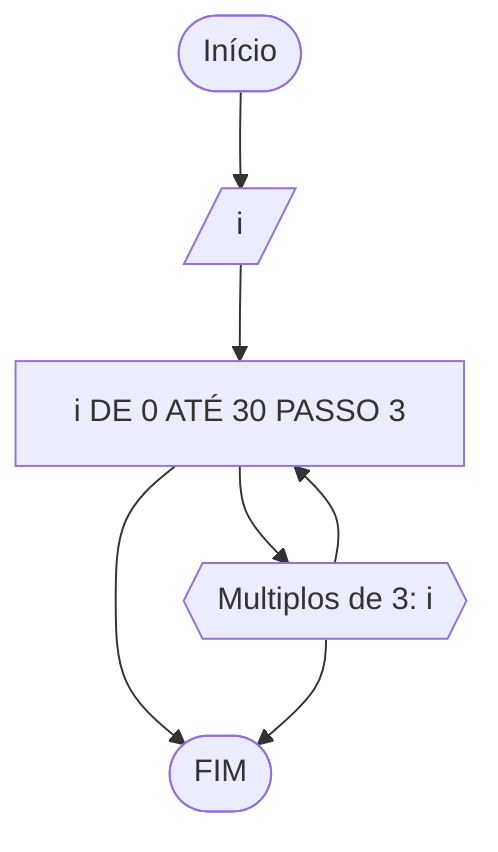

### Exercício 1

1) Represente, em fluxograma e pseudocódigo, um algoritmo para determinar se um número inteiro e positivo é par ou impar.

#### Fluxograma


```
ALGORITMO verifica_par_ímpar
DECLARE numero, resto: INTEIRO
ESCREVA "Digite um número positivo: "
LEIA numero, resto
ENQUANTO numero < 0 FAÇA
    ESCREVA "Digite um número positivo: "
    LEIA numero
FIM_ENQUANTO
resto = numero % 2
    SE resto == 0 ENTAO
       ESCREVA "O número é par"
    SENÃO 
       ESCREVA "O número é ímpar" 
FIM_ALGORITMO
```
```
|  |  |  |  |
```

### Exercício 2

Faça um algoritmo que exiba na tela uma contagem de 0 até 30, exibindo apenas os múltiplos de 3.

#### Fluxograma


```
ALGORITMO multiplos_3
DECLARE i: INTEIRO
INICIO
PARA I=0 ATÉ 30 FAÇA [PASSO 3]
	ESCREVA "Multiplos de 3: ",i 
FIM_ALGORITMO
```
