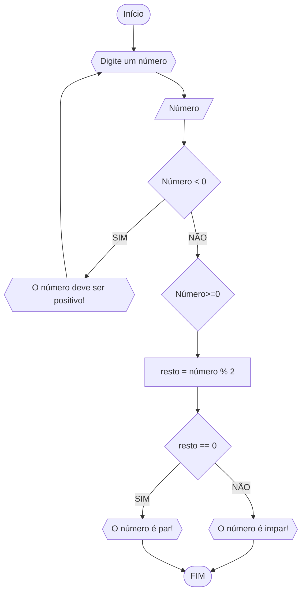
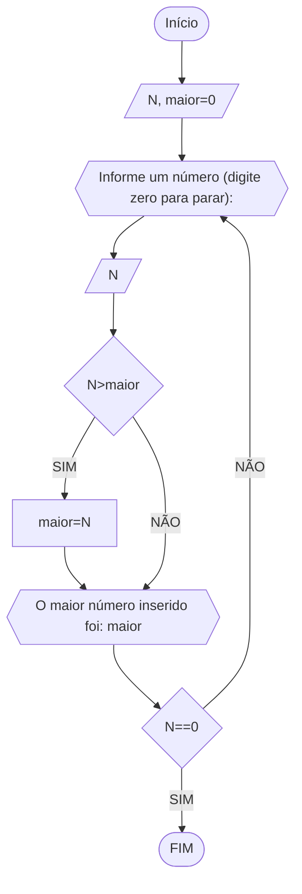
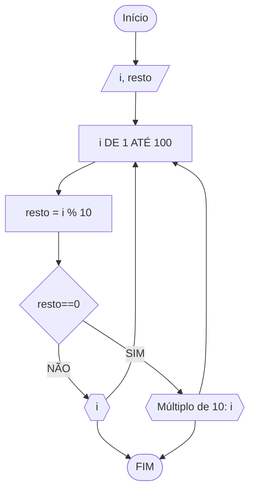
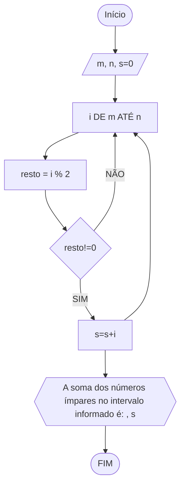

### Exercício 1

1) Represente, em fluxograma e pseudocódigo, um algoritmo para determinar se um número inteiro e positivo é par ou impar.

#### Fluxograma


```
ALGORITMO verifica_par_ímpar
DECLARE numero, resto: INTEIRO
ESCREVA "Digite um número positivo: "
LEIA numero, resto
ENQUANTO numero < 0 FAÇA
    ESCREVA "Digite um número positivo: "
    LEIA numero
FIM_ENQUANTO
resto = numero % 2
    SE resto == 0 ENTAO
       ESCREVA "O número é par"
    SENÃO 
       ESCREVA "O número é ímpar" 
FIM_ALGORITMO
```
```
|  |  |  |  |
```

### Exercício 2

Faça um algoritmo que exiba na tela uma contagem de 0 até 30, exibindo apenas os múltiplos de 3.

#### Fluxograma


```
ALGORITMO multiplos_3
DECLARE i: INTEIRO
INICIO
PARA I=0 ATÉ 30 FAÇA [PASSO 3]
	ESCREVA "Multiplos de 3: ",i 
FIM_ALGORITMO
```
### Exercício 3

Faça um algoritmo que determine o maior entre N números. A condição de parada é a entrada de um valor 0, ou seja, o algoritmo deve ficar calculando o maior até que a entrada seja igual a 0 (ZERO).

#### Fluxograma


```
ALGORITMO numero_maior
DECLARE N, maior: INTEIRO
INICIO
maior=0
REPITA
	ESCREVA "Informe um número (digite zero para parar): "
	LEIA N
	SE N>maior ENTÃO
		maior=N
		FIM_SE
	ESCREVER "O maior número inserido foi: ", maior
ATÉ N==0
```
### Exercício 4

Faça um algoritmo que conte de 1 a 100 e a cada múltiplo de 10 emita uma mensagem: “Múltiplo de 10”.

#### Fluxograma


```
ALGORITMO numero_maior
DECLARE i, resto: INTEIRO
INICIO
PARA i DE 1 ATÉ 100 FAÇA 
	resto=i%10
	SE resto==0 ENTÃO
		ESCREVER "Múltiplo de 10: " i 
	SENAO
	ESCREVER i
FIM_PARA
FIM	
```
### Exercício 5

Ler o valor de dois números inteiros n e m. Calcular e exibir a soma de todos os números ímpares positivos entre n e m.

#### Fluxograma


```
ALGORITMO soma_impares
DECLARE m, n, s=0: INTEIRO
INICIO
PARA i DE m ATÉ n FAÇA 
	resto=i%2
	SE resto!=0 ENTÃO
		s=s+i
FIM_PARA
ESCREVER "A soma dos números ímpares no intervalo informado é: ", s
FIM	
```
