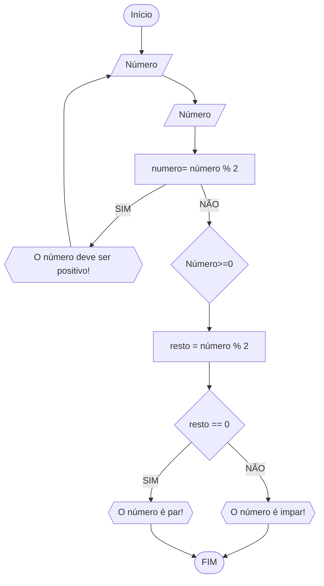

### Exercício 1

1) Represente, em fluxograma e pseudocódigo, um algoritmo para determinar se um número inteiro e positivo é par ou impar.

#### Fluxograma


```
ALGORITMO verifica_par_ímpar
DECLARE numero, resto: INTEIRO
ESCREVA "Digite um número positivo: "
LEIA numero, resto
ENQUANTO numero < 0 FAÇA
    ESCREVA "Digite um número positivo: "
    LEIA numero
FIM_ENQUANTO
resto = numero % 2
    SE resto == 0 ENTAO
       ESCREVA "O número é par"
    SENÃO 
       ESCREVA "O número é ímpar" 
FIM_ALGORITMO
```
```
|  |  |  |  |
```

### Exercício 2

Faça um algoritmo que exiba na tela uma contagem de 0 até 30, exibindo apenas os múltiplos de 3.

#### Fluxograma


```
ALGORITMO print_n_primeiros 2 DECLARE n, num: INTEIRO 3 INICIO 4 ESCREVA “Digite um número: ” 4 LEIA n // variável de entrada n 4 num ← 1 // variável num inicializada 5 REPITA 7 ESCREVA “Número ”, num 8 num ← num + 1 // num =+ 1 (incremento) 9 ATE_QUE n <= num // n iterações


ALGORITMO multiplos_3
DECLARE numero: INTEIRO
		multiplo: REAL
INICIO
numero = 0
REPITA
	multiplo=numero*3
	ESCREVA "
	numero=numero+1
ATE_QUE numero=30
LEIA numero, resto
ENQUANTO numero < 0 FAÇA
    ESCREVA "Digite um número positivo: "
    LEIA numero
FIM_ENQUANTO
resto = numero % 2
    SE resto == 0 ENTAO
       ESCREVA "O número é par"
    SENÃO 
       ESCREVA "O número é ímpar" 
FIM_ALGORITMO
```
