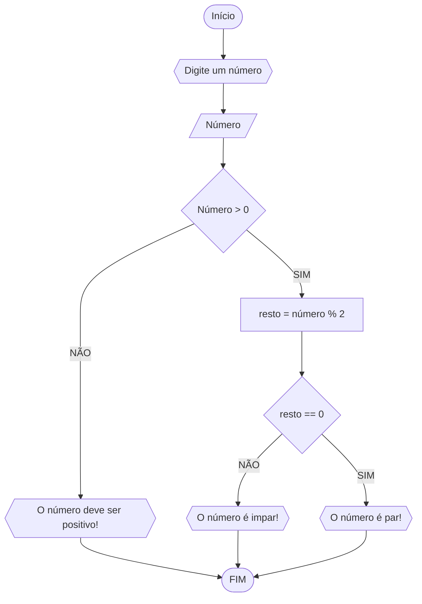

### Exercício 1

1) Represente, em fluxograma e pseudocódigo, um algoritmo para determinar se um número inteiro e positivo é par ou impar.

#### Fluxograma


```
ALGORITMO verifica_par_ímpar
DECLARE numero, resto INTEIRO
ESCREVA "Digite um número: "
LEIA numero, resto
SE numero > 0 ENTAO
    resto = numero % 2
    SE resto == 0 ENTAO
       ESCREVA "O número é par"
    SENÃO 
       ESCREVA "O número é ímpar"
SENAO 
    ESCREVA "O número deve ser positivo!"
 
FIM_ALGORITMO

```
