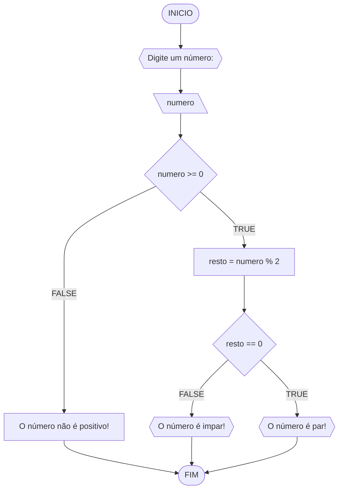
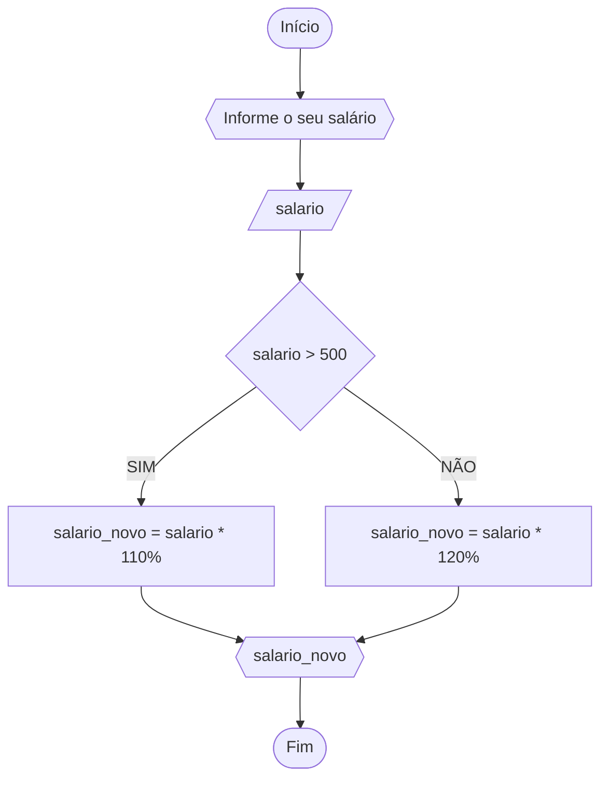
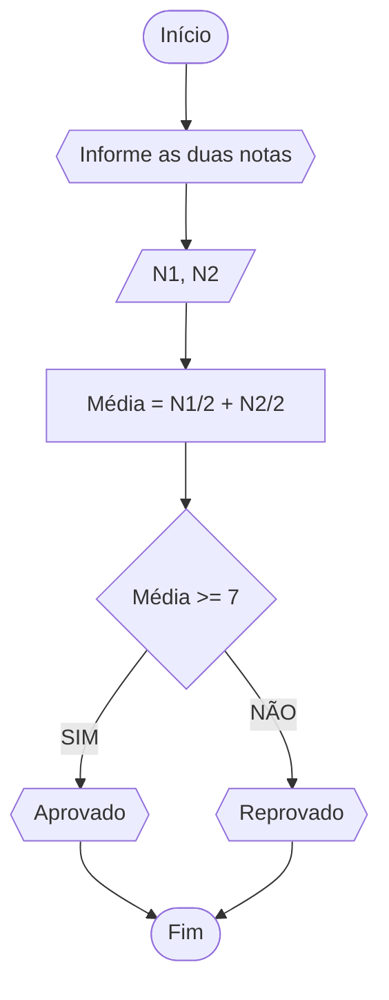
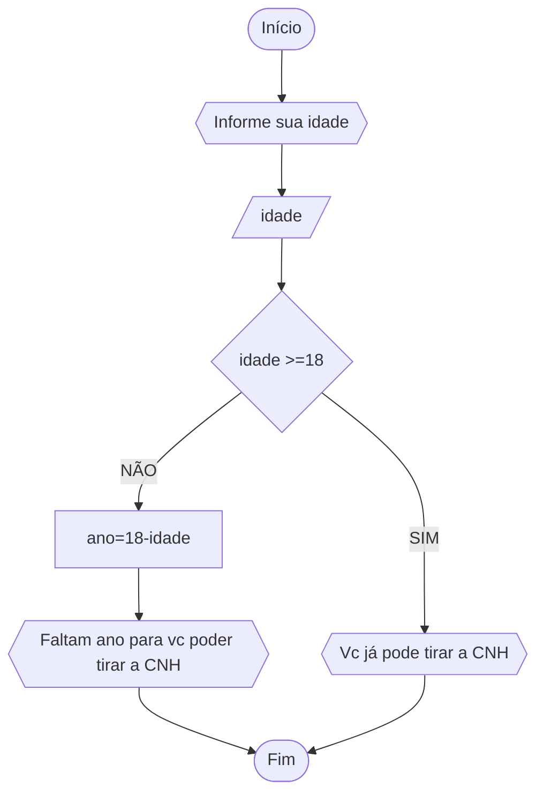

# UNIFOR
**Nome**: Marcus Vinicius Nunes Guimarães <br>
**Disciplina**: Raciocínio lógico algorítmico

## Lista de exercícios 01

### Exercício 01 (1 ponto)
Represente, em fluxograma e pseudocódigo, um algoritmo para determinar se um número inteiro e positivo é par ou impar.

#### Fluxograma (0,25 ponto)



#### Pseudocódigo (0,5 ponto)
```
1  ALGORTIMO verifica_par_impar
2  DECLARE numero, resto: INTEIRO
3  ESCREVA "Digite um número: "
4  INICIO
4  LEIA numero
5  SE numero >= 0 ENTAO                  // verifica se o inteiro é positivo
6    resto = numero % 2                 // calcula o resto da divisão por 2
7    SE resto == 0 ENTAO                // verifica se o resto é igual a zero
8      ESCREVA "O número é par!"
9    SENAO
10     ESCREVA "O número é impar!"
11   FIM_SE
11  SENAO                                // caso inteiro for negativo (condição linha 5)
12    ESCREVA "O número deve ser postivo!"
13  FIM_SE
13 FIM
```

#### Teste de mesa (0,25 ponto)
| numero | numero >= 0 | resto | resto == 0 | Saída |
| -- | -- | -- | -- | -- | 
| -1 | F |   |   | "O número deve ser postivo!" |
| 0  | V | 0 | V | "O número é par!" |
| 13 | V | 1 | F | "O número é impar!" |
| 30 | V | 0 | V | "O número é par!" |

## Exercício 02 (3 pontos)
Represente, em fluxograma e pseudocódigo, um algoritmo para calcular o novo salário de um funcionário. 
Sabe-se que os funcionários que recebem atualmente salário de até R$ 500 terão aumento de 20%; os demais terão aumento de 10%.

#### Fluxograma (1.0 ponto)


#### Pseudocódigo (1.0 ponto)

```
ALGORITMO
DECLARE salario, salario_novo NUMÉRICO 
ESCREVA “Digite seu salário” 
LEIA salario
SE salario > 500
	ENTÃO
		salario_novo = salario * 110%
		ESCREVA "salario_novo"
SENÃO
	salario_novo = salario * 120%
	ESCREVA “salario_novo“ 
FIM_ALGORITMO.
```
#### Teste de mesa (1.0 ponto)

| LEIA salario | salario > 500 | salario_novo | ESCREVA “salario_novo“ |
| -- | -- | -- | -- |
|      500     |      F      |     600      |      "600"             | 
|      400     |      F      |     480      |      "480"             | 
|     1000     |      V      |    1100      |      "1100"            | 

## Exercício 03 (3 pontos)
Represente, em fluxograma e pseudocódigo, um algoritmo para calcular a média aritmética entre duas notas de um aluno e mostrar sua situação, que pode ser aprovado ou reprovado.

#### Fluxograma (1 ponto)


#### Pseudocódigo (1 ponto)
```
ALGORITMO
DECLARE N1, N2, M NUMÉRICO 
ESCREVA “Digite as duas notas” 
LEIA N1, N2 
M = (N1+N2)/2
SE M >= 7
	ENTÃO ESCREVA “Aprovado” 
SENÃO  
	ESCREVA “Reprovado“ 
FIM_ALGORITMO.
```

#### Teste de mesa (1 ponto)

| LEIA N1 | LEIA N2 | M = (N1+N2)/2 | SE M >= 7 | SAÍDA | 
|      --  |      --   |      --    |      --   |      --      | 
| 10       | 8          |9          |  V        | “Aprovado”   |
| 5        | 3          | 4         | F         | “Reprovado“  |
| 8        | 6          | 7         | V         | “Aprovado”  |

## Exercício 04 (3 pontos)
Represente, em fluxograma e pseudocódigo, um algoritmo que, a partir da idade do candidato(a), determinar se pode ou não tirar a CNH. 
Caso não atender a restrição de idade, calcular quantos anos faltam para o candidato estar apto.

#### Fluxograma (1.0 ponto)


#### Pseudocódigo (1.0 ponto)
```
ALGORITMO
DECLARE idade, ano NUMÉRICO 
ESCREVA “informe sua idade” 
LEIA idade
SE idade >= 18
	ENTÃO
		ESCREVA "Vc já pode tirar a CNH"
SENÃO
	ano = 18-idade
	ESCREVA “Faltam “,ano 
FIM_ALGORITMO.
```

#### Teste de mesa (1.0 ponto)

| LEIA idade | SE idade >= 18 | ano = 18-idade | SAÍDA | 
|      --      |      --      |      --      |      --      |
| 15     | F       | 3        |      Faltam 3       |
| 19     | V       |          |   "Vc já pode tirar a CNH"      |
| 16     | F       | 2        |      Faltam 2        |
