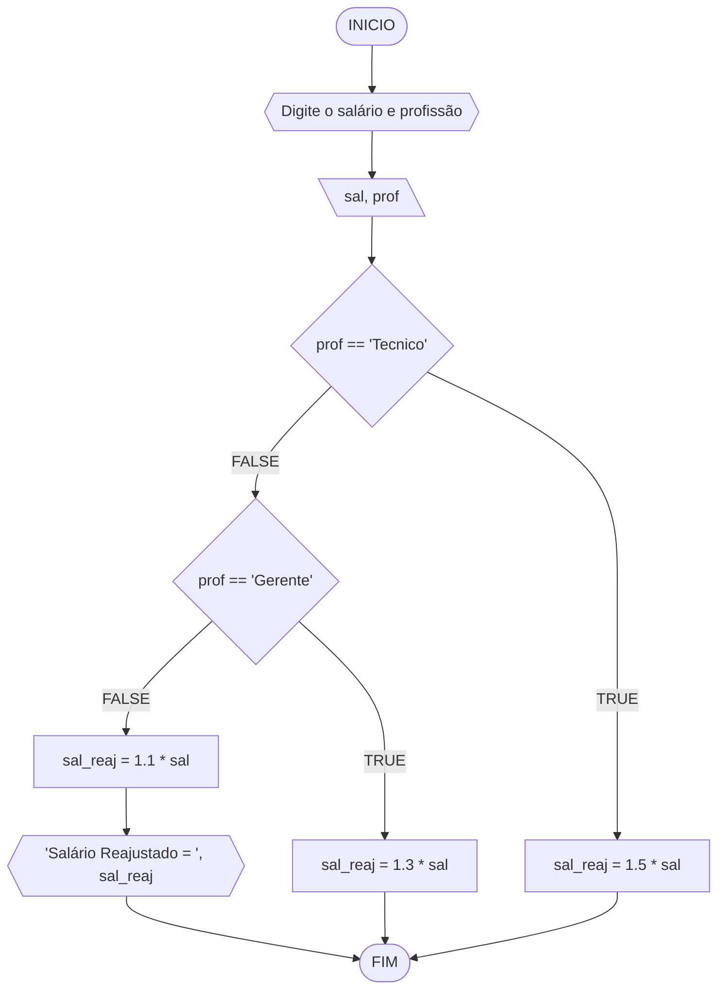
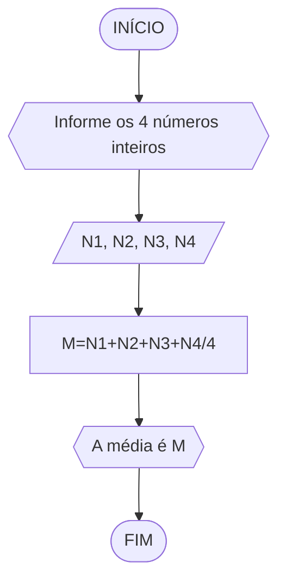
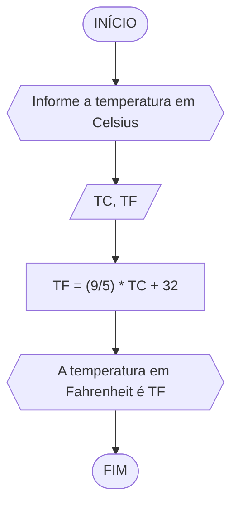
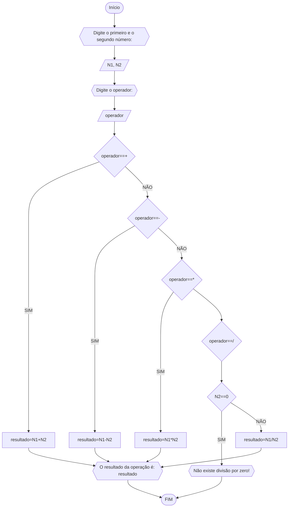
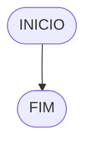

# UNIFOR
**Nome**: Marcus Vinicius Nunes Guimarães <br>
**Disciplina**: Raciocínio lógico algorítm

## Exercício exemplo
Represente, em fluxograma e pseudocódigo, um algoritmo para calcular o adicional de salário de funcionário por cargo de uma empresa fictícia. Sabe-se que os funcionários de cargo técnico receberão reajuste de 50%, cargo de gerência, um reajuste de 30% e demais, um reajuste de 10%. 

#### Fluxograma


#### Pseudocódigo
```
1  ALGORITMO calReajuste
2  DECLARE  sal, sal_reaj: real, prof: caractere
3  INICIO
4  LEIA sal, prof
5  ESCOLHA
6   CASO prof == “Técnico”		// caso 1
7     sal_reaj ← 1.5 * sal
8   CASO prof = “Gerente”		// caso 2
9     sal_reaj ← 1.3 * sal
10  SENÃO
11    sal_reaj ← 1.1 * sal
12 FIM_ESCOLHA
13 ESCREVA “Salário Reajustado = “, sal_reaj
14 FIM
```

#### Teste
| sal | prof | prof == “Técnico” | prof = “Gerente” | sal_reaj | Saída |
| -- | -- | -- | -- | -- | -- |
| 1000 | Técnico | V | F | 1500 | “Salário Reajustado = 1500“ |
| 2000 | Gerente | F | V | 2600 | “Salário Reajustado = 2600“ |
| 9000 | Diretor | F | F | 9900 | “Salário Reajustado = 9900“ |

## Lista de exercícios 02

### Exercício 01 (2.5 pontos)
Calcule a média de quatro números inteiros dados.

#### Fluxograma (1.0 ponto)


#### Pseudocódigo (1.0 ponto)
```
ALGORITMO
DECLARE N1,N2,N3,N4 : INTEIRO
M : REAL
INICIO
ESCREVA "Informe os 4 números inteiros: "
LEIA N1,N2,N3,N4
M=(N1+N2+N3+N4)/4
ESCREVA " A média é: ",M
FIM

```
#### Teste de mesa (0.5 ponto)

| N1 | N2 | N3 | N4 | M=(N1+N2+N3+N4)/4 | SAÍDA |
|      --      |      --      |      --      |      --      |      --      |    --    |
| 0     | 5       | 1    |  3     |  2.25   |      " A média é: 2.25 "    |
| 10   | 23        | 7        | 20 | 15  |    " A média é: 15 "       |
| 8   | 8         | 8        | 8 | 8  |     " A média é: 8 "      |


### Exercício 02 (2.5 pontos)
Leia uma temperatura dada em Celsius (C) e imprima o equivalente em Fahrenheit (F). (Fórmula de conversão: F = (9/5) * C + 32)

#### Fluxograma (1.0 ponto)


#### Pseudocódigo (1.0 ponto)
```
ALGORITMO converter_temperatura
DECLARE TC, TF: REAL
ESCREVA "Digite a temperatura em gaus Celsius: "
LEIA TC
TF = (9/5) * TC + 32
ESCREVA "A temperatura em graus Fahrenheit é: ",TF
FIM
```

#### Teste de mesa (0.5 ponto)

| TC | TF = (9/5) * TC + 32 | SAÍDA | 
|      --      |      --      |      --      | 
| 30     | 86       | "A temperatura em graus Fahrenheit é: 86"    |  
| 37   |     98.6   | "A temperatura em graus Fahrenheit é: 98.6"     | 
| 18   | 64.4       | "A temperatura em graus Fahrenheit é: 64.4"     | 


### Exercício 03 (2.5 pontos)
Receba dois números reais e um operador e efetue a operação correspondente com os valores recebidos (operandos). 
O algoritmo deve retornar o resultado da operação selecionada simulando todas as operações de uma calculadora simples.

#### Fluxograma (1.0 ponto)

### Exercício 3

Receba dois números reais e um operador e efetue a operação correspondente com os valores recebidos (operandos). O algoritmo deve retornar o resultado da operação selecionada simulando todas as operações de uma calculadora simples.

#### Fluxograma


#### Pseudocódigo (1.0 ponto)
```
ALGORITMO calculadora
DECLARE N1, N2, resultado: REAL
		operador: CARACTERE
INICIO
ESCREVA "Digite o primeiro número: "
LEIA N1
ESCREVA "Digite o segundo número: "
LEIA N2
ESCREVA "Digite o operador: "
LEIA operador
ESCOLHA
	CASO operador=="+"
		resultado=N1+N2
	CASO operador=="-"
		resultado=N1-N2
	CASO operador=="*"
		resultado=N1*N2
	CASO operador=="/"
		SE N2==0 ENTÃO
			ESCREVA "Não existe divisão por zero!"
		SENÃO
			resultado=N1/N2
		FIM_SE
FIM_ESCOLHA
ESCREVA "O resultado da operação é: ", resultado
FIM	
```

#### Teste de mesa (0.5 ponto)

| LEIA N1 | LEIA N2 | LEIA operador | operador=="+"| operador=="-" | operador=="*" |operador=="/" | SAÍDA |
|      --      |      --      |      --      |      --      |      --      |    --      |    --      |    --      | 
| 5     | 1       | +    |  V     | F    |  F  |  F | "O resultado da operação é: 6"  |
| verticais,   | mas          | não é        | obrigatório. | Entendido ?  |    |   |   |

### Exercício 04 (2.5 pontos)
Elaborar um algoritmo que, dada a idade, classifique nas categorias: infantil A (5 - 7 anos), infantil B (8 -10 anos), juvenil A (11 - 13 anos), juvenil B (14 -17 anos) e adulto (maiores que 18 anos).

#### Fluxograma (1.0 ponto)



#### Pseudocódigo (1.0 ponto)

```
Algoritmo ClassificaCategoria
FIM_ALGORITMO
```

#### Teste de mesa (0.5 ponto)

| nome_coluna1 | nome_coluna2 | nome_coluna3 | nome_coluna4 | nome_coluna5 | 
|      --      |      --      |      --      |      --      |      --      | 
| Adicione     | espaço       | se quiser    |  alinhar     | as barras    |
| verticais,   | mas          | não é        | obrigatório. | Entendido ?  |
