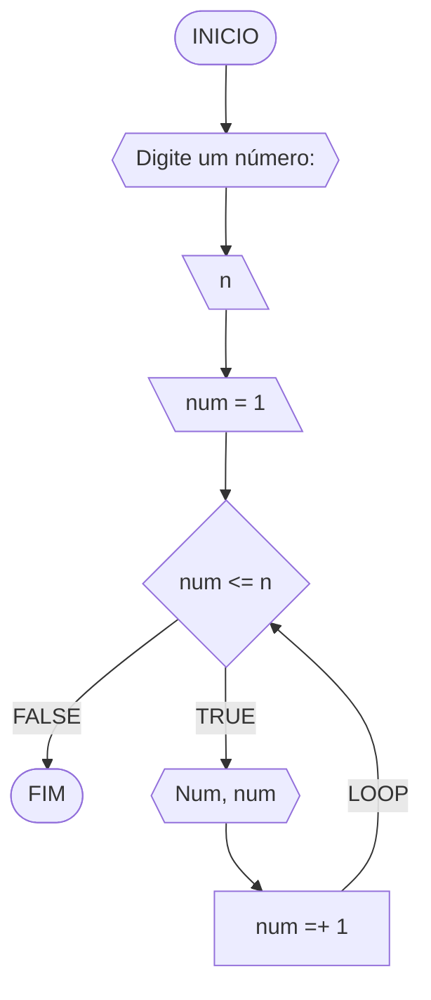
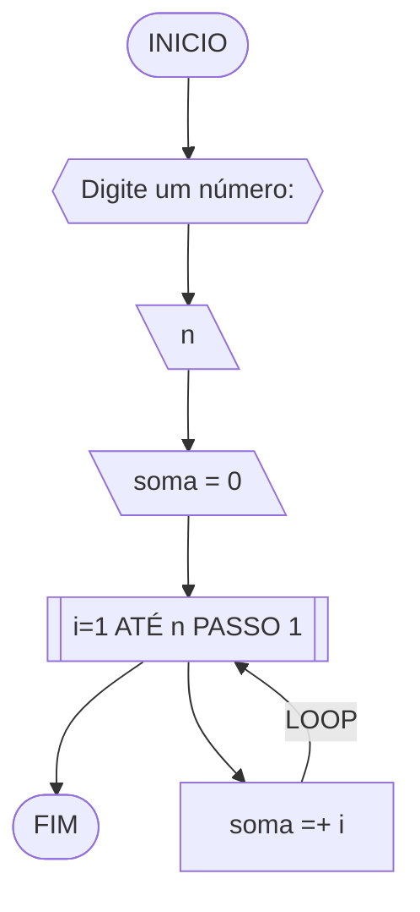
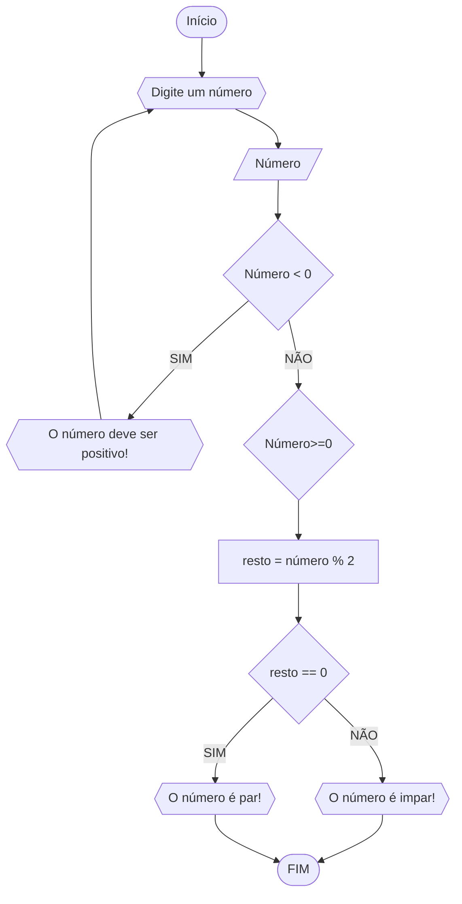
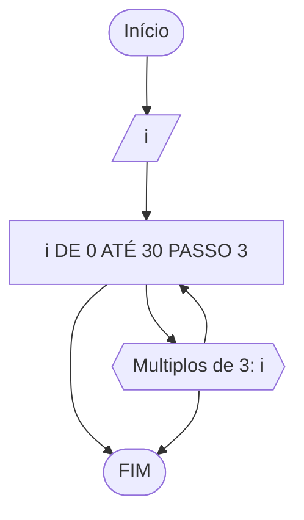
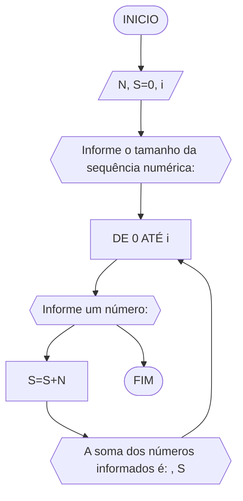
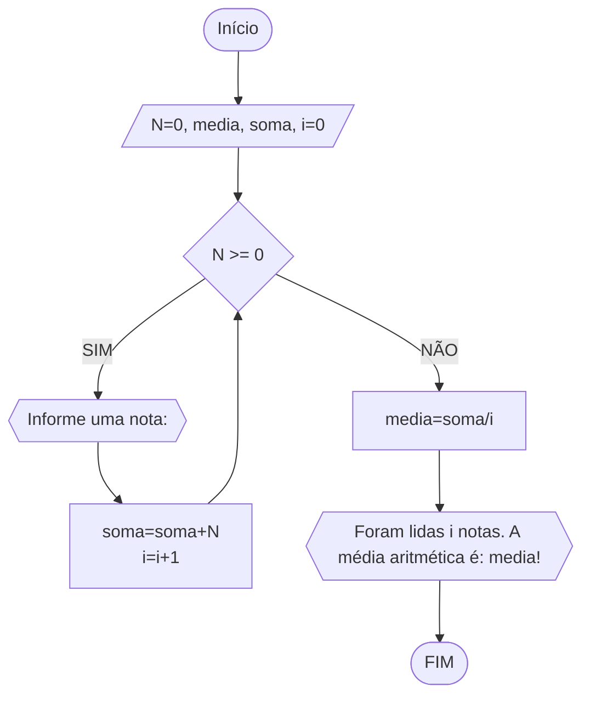

# UNIFOR
**Nome**: Marcus Vinicius Nunes Guimarães <br>
**Disciplina**: Raciocínio lógico algorítmico

## Exercício exemplo 1
Implemente e teste um programa que imprima os n primeiros números.

#### Fluxograma


#### Pseudocódigo
```
1 ALGORITMO print_n_primeiros
2 DECLARE n, num: INTEIRO
3 INICIO
4 ESCREVA “Digite um número: ”
4 LEIA n			// variável de entrada n
4 num ← 1			// variável num inicializada
5 ENQUANTO num <= n FAÇA	// n iterações
7	ESCREVA “Número ”, num
8	num ← num + 1		// num =+ 1 (incremento)
8 FIM_ENQUANTO
9 FIM
```

#### Teste de mesa
| it | n  | num | num <= n | Saída      | num =+ 1 |
| -- | -- | --  | --       | --         | --       |
| 1  | 10 | 1   | True     | Número 1   | 2        |
| 2  | 10 | 2   | True     | Número 2   | 3        |
| 3  | 10 | 3   | True     | Número 3   | 4        |
| 4  | 10 | 4   | True     | Número 4   | 5        |
| 5  | 10 | 5   | True     | Número 5   | 6        |
| 6  | 10 | 6   | True     | Número 6   | 7        |
| 7  | 10 | 7   | True     | Número 7   | 8        |
| 8  | 10 | 8   | True     | Número 8   | 9        |
| 9  | 10 | 9   | True     | Número 9   | 10       |
| 10 | 10 | 11  | True     | Número 10  | 11       |
| 11 | 10 | 11  | False    |            |          |

## Exercício exemplo 2
Implemente e teste um programa que some os n primeiros números.

#### Fluxograma


#### Pseudocódigo
```
1  ALGORITMO	soma_n_numeros()
2  DECLARE	n, i, soma: INTEIRO
3  INICIO
4  ESCREVA “Digite a quantidade de números: ”
5  LEIA n		// variável de entrada n
7  soma ← 0		// variável soma inicializada
6  PARA i DE 1 ATÉ n PASSO 1 FAÇA
7	soma ← soma + i	// soma =+ i (incremento)
8  FIM_PARA
9  ESCREVA “A soma é igual a ”, soma
10 FIM
```

#### Teste de mesa
| it | n  | soma | i  | soma =+ i |
| -- | -- | --   | -- | --        |
| 1  | 10 | 0    | 1  | 1         |
| 2  | 10 | 1    | 2  | 3         |
| 3  | 10 | 3    | 3  | 6         |
| 4  | 10 | 6    | 4  | 10        |
| 5  | 10 | 10   | 5  | 15        |
| 6  | 10 | 15   | 6  | 21        |
| 7  | 10 | 21   | 7  | 28        |
| 8  | 10 | 28   | 8  | 36        |
| 9  | 10 | 36   | 9  | 45        |
| 10 | 10 | 45   | 10 | 55        | 

## Lista de exercícios 03

### Exercício 01 (2.5 pontos)
Atualize o algoritmo para determinar se um número inteiro e positivo é par ou ímpar, usando uma laço condicional para aceitar apenas números maiores ou iguais a zero. 

#### Fluxograma (1.0 ponto)


#### Pseudocódigo (1.0 ponto)
```
ALGORITMO verifica_par_ímpar
DECLARE numero, resto: INTEIRO
ESCREVA "Digite um número positivo: "
LEIA numero, resto
ENQUANTO numero < 0 FAÇA
    ESCREVA "Digite um número positivo: "
    LEIA numero
FIM_ENQUANTO
resto = numero % 2
    SE resto == 0 ENTAO
       ESCREVA "O número é par"
    SENÃO 
       ESCREVA "O número é ímpar" 
FIM_ALGORITMO
```

#### Teste de mesa (0.5 ponto)

| LEIA numero | numero < 0 | resto = numero % 2 | resto == 0 | SAÍDA | 
|      --      |      --      |      --      |      --      |      --      | 
| -4     | V       |    |       | "Digite um número positivo: "    |
| 5   | F          | 1        | F | "O número é ímpar" |
| 8   | F          | 0        | V | "O número é par"  |

### Exercício 02 (2.5 pontos)
Faça um algoritmo que exiba na tela uma contagem de 0 até 30, exibindo apenas os múltiplos de 3.

#### Fluxograma (1.0 ponto)


#### Pseudocódigo (1.0 ponto)
```
ALGORITMO multiplos_3
DECLARE i: INTEIRO
INICIO
PARA I=0 ATÉ 30 FAÇA [PASSO 3]
	ESCREVA "Multiplos de 3: ",i 
FIM_ALGORITMO
```

#### Teste de mesa (0.5 ponto)

| Valor de i | Saída | 
|      --    |  --      |      
| 0     |        | 
| 1   |           | 
| 2   |           | 
| 3   | "Multiplos de 3: ",  3 | 
| 4   |           | 
| 5   |           | 
| 6   | "Multiplos de 3: ",  6 | 
| 7   |           | 
| 8   |           | 
| 9   | "Multiplos de 3: ",  9 | 


### Exercício 03 (2.5 pontos)
Dada uma sequência de números inteiros, calcular a sua soma. 
Por exemplo, para a sequência {12, 17, 4, -6, 8, 0}, o seu programa deve escrever o número 35.

#### Fluxograma (1.0 ponto)


#### Pseudocódigo (1.0 ponto)
```
Algoritmo Soma_sequencia
DECLARE N, S=0, i: INTEIRO
INICIO
ESCREVA "Informe o tamanho da sequência numérica: "
LEIA i
PARA 0 ATÉ i FAÇA 
	ESCREVA "Informe um número: "
	LEIA N
	S=S+N
	ESCREVER "A soma dos números informados é: ", S
FIM_PARA
FIM_ALGORITMO
```

#### Teste de mesa (0.5 ponto)

| LEIA i | PARA 0 ATÉ i FAÇA | S=S+N | SAÍDA | 
|      --      |      --      |      --      |      --      |     
| 5     | 3,5,-1,0,2       | 9    |  "A soma dos números informados é: ", 9     | 
| 3  | -3, 10, 4         | 11        | "A soma dos números informados é: ", 11 | 

### Exercício 04 (2.5 pontos)
Escreva um programa que leia a nota de diversos alunos, até que seja digitada uma nota negativa. 
Nesse momento, ele mostra a média aritmética de todas as notas lidas e quantas notas foram lidas. 
Ex. Foram lidas 14 notas. A média aritmética é 6.75!

#### Fluxograma (1.0 ponto)


#### Pseudocódigo (1.0 ponto)
```
ALGORITMO numero_maior
DECLARE N, media, soma: REAL
		i: INTEIRO
INICIO
media=0
i=0
N=0
ENQUANTO N>=0 FAÇA
	ESCREVA "Informe uma nota: "
	LEIA N
	soma=soma+N
	i=i+1
FIM_ENQUANTO	
media=soma/i
ESCREVA "Foram lidas i notas. A média aritmética é: media!"
FIM_ALGORITMO
```

#### Teste de mesa (0.5 ponto)

| LEIA N |  N>=0 | soma=soma+N | i=i+1 | media=soma/i | SAÍDA | 
|      --      |      --      |      --      |      --      |      --      | -- |
| 5     |  V | 5       | 1    |       |     |
| 2   | V    | 7        | 2 |   |  |
| 3   | V          | 10        | 3 |   |  |
| 0   | V          | 10        | 4 |   |  |
| -2   | F          |        |  |  2.5 | "Foram lidas 4 notas. A média aritmética é: 2,5!"  |

